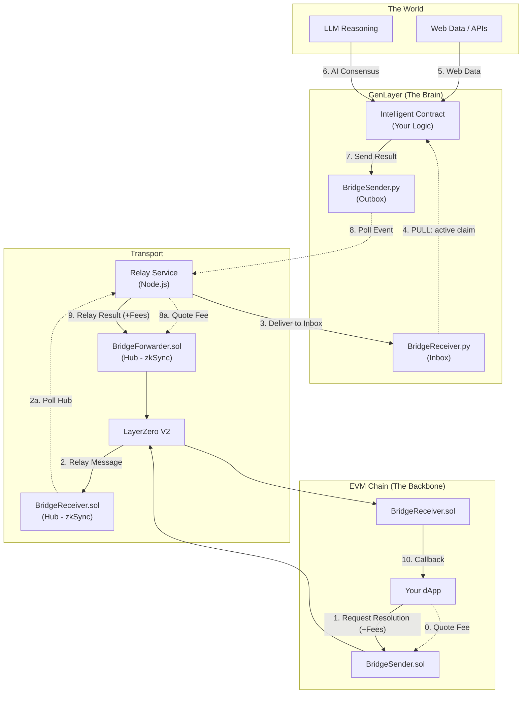

# GenLayer Bridge Boilerplate

**Connect your blockchain to the Resolution Layer.**


This boilerplate provides the complete infrastructure to connect **GenLayer Intelligent Contracts** with **EVM** chains (Base, Ethereum, etc.) via **LayerZero V2**. It enables any blockchain to offload complex, non-deterministic work—AI reasoning, web access, data verification—to GenLayer and receive verified results.

## 📚 Table of Contents

- [The Resolution Layer](#-the-resolution-layer)
- [Architecture](#-architecture)
  - [Message Flow](#message-flow)
- [Repository Structure](#-repository-structure)
- [Key Contracts](#-key-contracts)
- [Prerequisites](#-prerequisites)
- [Deployment Guide](#-deployment-guide)
  - [1. Installation](#1-installation)
  - [2. Configuration](#2-configuration)
  - [3. Deploy EVM Infrastructure](#3-deploy-evm-infrastructure)
  - [4. Link EVM Contracts](#4-link-evm-contracts)
  - [5. Deploy GenLayer "Brain"](#5-deploy-genlayer-brain)
  - [6. Activate the Resolution Layer](#6-activate-the-resolution-layer)
- [Development & Debugging](#-development--debugging)
- [Troubleshooting](#-troubleshooting)
- [License](#-license)

---

## 🌐 The Resolution Layer

Blockchains are powerful but blind. They cannot read news, verify events, or access the web. GenLayer solves this by acting as the **Resolution Layer** for the ecosystem.

- **Your Chain (Backbone)**: Holds liquidity, users, and core logic.
- **GenLayer (Brain)**: Handles intelligence, web data, and AI processing.

This bridge connects the two, allowing you to build "Intelligent dApps" without migrating your users or liquidity.

## 🏗 Architecture

The bridge implements a **Hub-and-Spoke** model with **zkSync** serving as the central hub for GenLayer's interactions with the wider EVM ecosystem via LayerZero.



### Message Flow

#### GenLayer → EVM

1.  **Source IC** calls `BridgeSender.send_message(target_chain_eid, target_contract, data)`.
2.  **Service** polls `get_message_hashes()` and `get_message()` on GenLayer.
3.  **Service** calls `BridgeForwarder.quoteCallRemoteArbitrary()` to determine the fee.
4.  **Service** calls `BridgeForwarder.callRemoteArbitrary()` on zkSync (Hub) with the required **native fee**.
5.  **LayerZero** delivers to `BridgeReceiver` on destination chain (Target).
6.  **BridgeReceiver** dispatches to target contract via `processBridgeMessage()`.

#### EVM → GenLayer

1.  **dApp** calls `BridgeSender.quoteSendToGenLayer()` to get the fee.
2.  **dApp** calls `BridgeSender.sendToGenLayer(targetContract, data, options)` with `msg.value >= fee`.
3.  **LayerZero** delivers to `BridgeReceiver.sol` on zkSync (Hub).
4.  **BridgeReceiver** (Hub) stores message (not just event) for polling.
5.  **Service** polls `getPendingGenLayerMessages()` on zkSync (Hub).
6.  **Service** calls `BridgeReceiver.receive_message()` on GenLayer.
7.  **Service** calls `markMessageRelayed()` on zkSync (Hub).
8.  **Target IC** calls `BridgeReceiver.claim_all_messages()` to receive (PULL model).

## 📂 Repository Structure

This is a monorepo containing all components of the bridge:

- **/smart-contracts**: Solidity contracts for EVM chains (Hardhat).
- **/intelligent-contracts**: Python contracts for GenLayer.
- **/service**: Node.js relay service that polls and relays messages.
- **/example**: Complete bidirectional example with StringSender/StringReceiver.

## 🔑 Key Contracts

| Contract              | Chain    | Purpose                               |
| :-------------------- | :------- | :------------------------------------ |
| `BridgeSender.py`     | GenLayer | Stores outbound GL→EVM messages       |
| `BridgeReceiver.py`   | GenLayer | Receives EVM→GL messages (PULL model) |
| `BridgeForwarder.sol` | zkSync   | Relays GL→EVM via LayerZero           |
| `BridgeReceiver.sol`  | zkSync   | Stores EVM→GL messages for polling    |
| `BridgeSender.sol`    | Base/EVM | Entry point for EVM→GL messages       |

## 📋 Prerequisites

To bridge intelligence to your dApp, you need:

- **Node.js**: v18+ & **npm**: v9+
- **GenLayer Studio**: [GenLayer Studio](https://studio.genlayer.com/)
- **Wallet**: A private key with testnet funds on:
  - **Base Sepolia** (Example Target Chain)
  - **zkSync Sepolia** (Hub Chain)

## 🚀 Deployment Guide

Follow these steps to deploy your own instance of the bridge infrastructure.

### 1. Installation

```bash
# 1. Install Smart Contracts dependencies (EVM)
cd smart-contracts && npm install && cd ..

# 2. Install Bridge Service dependencies (Relayer)
cd service && npm install && cd ..
```

### 2. Configuration

Create your environment files.

**Smart Contracts (.env)**

```bash
cp smart-contracts/.env.example smart-contracts/.env
# EDIT: Add your PRIVATE_KEY and RPC URLs
```

**Service (.env)**

```bash
cp service/.env.example service/.env
# EDIT: Add your PRIVATE_KEY and GENLAYER_RPC_URL (e.g. https://studio.genlayer.com/api/rpc)
```

### 3. Deploy EVM Infrastructure

Deploy the "mailbox" contracts to the EVM chains.

```bash
cd smart-contracts

# 1. Deploy Receiver (Target & Hub)
CONTRACT=receiver npx hardhat run scripts/deploy.ts --network baseSepoliaTestnet
CONTRACT=receiver npx hardhat run scripts/deploy.ts --network zkSyncSepoliaTestnet

# 2. Deploy Forwarder (Hub - zkSync)
CONTRACT=forwarder npx hardhat run scripts/deploy.ts --network zkSyncSepoliaTestnet

# 3. Deploy Sender (Target - Base)
CONTRACT=sender npx hardhat run scripts/deploy.ts --network baseSepoliaTestnet
```

### 4. Link EVM Contracts

Configure the trust relationships so messages can flow securely.

```bash
# Configure Hub (zkSync)
ACTION=set-trusted-forwarder npx hardhat run scripts/configure.ts --network zkSyncSepoliaTestnet
ACTION=set-authorized-relayer npx hardhat run scripts/configure.ts --network zkSyncSepoliaTestnet
ACTION=set-bridge-address npx hardhat run scripts/configure.ts --network zkSyncSepoliaTestnet

# Configure Target (Base)
ACTION=set-sender-receiver npx hardhat run scripts/configure.ts --network baseSepoliaTestnet
ACTION=set-trusted-forwarder npx hardhat run scripts/configure.ts --network baseSepoliaTestnet
```

### 5. Deploy GenLayer "Brain"

Deploy the Intelligent Contracts via [GenLayer Studio](https://studio.genlayer.com/):

1.  **Deploy `BridgeSender.py`**: The exit point for results returning to EVM.
    - _No args required._
2.  **Deploy `BridgeReceiver.py`**: The **Inbox** that holds incoming requests.
    - _Arg `initial_relayer`: Your service wallet address (from `.env`)._

### 6. Activate the Resolution Layer

Update `service/.env` with your new contract addresses:

```env
BRIDGE_SENDER_ADDRESS=<GenLayer BridgeSender Address>
BRIDGE_RECEIVER_IC_ADDRESS=<GenLayer BridgeReceiver Address>
ZKSYNC_BRIDGE_FORWARDER_ADDRESS=<zkSync BridgeForwarder Address>
ZKSYNC_BRIDGE_RECEIVER_ADDRESS=<zkSync BridgeReceiver Address>
```

Start the relay:

```bash
cd service
npm run build
npm start
```

_The service is now polling. Your bridge is live._

## 🛠 Development & Debugging

The `service` directory includes a CLI for debugging the bridge state.

```bash
cd service

# Check zkSync BridgeReceiver state
npx ts-node cli.ts check-receiver

# Check Base BridgeSender state
npx ts-node cli.ts check-sender

# Check zkSync BridgeForwarder state
npx ts-node cli.ts check-forwarder

# Verify all configurations
npx ts-node cli.ts check-config

# List pending messages on zkSync
npx ts-node cli.ts pending-messages

# Debug a specific transaction
npx ts-node cli.ts debug-tx <hash>
```

## 🧪 Example: "Hello World"

To demonstrate the capability, we provide a bidirectional messaging example.

👉 **[Run the Example](example/README.md)**

- **EVM → GenLayer**: Send a string to the Inbox. The Intelligent Contract claims it.
- **GenLayer → EVM**: The Intelligent Contract sends a response back to the EVM chain.

## 🛠 Troubleshooting

- **Service Logs**: The `service` console is your best debugging tool. It tracks every step of the relay.
- **Gas**: Ensure your relayer wallet has ETH on both Base Sepolia and zkSync Sepolia.
- **Trust**: If messages fail to deliver, check that `set-trusted-forwarder` was run on the target chain.
- **LayerZero Endpoints**: Ensure you are using the correct Endpoint IDs for your networks.
  - zkSync Sepolia: `40305`
  - Base Sepolia: `40245`

## 📄 License

MIT
